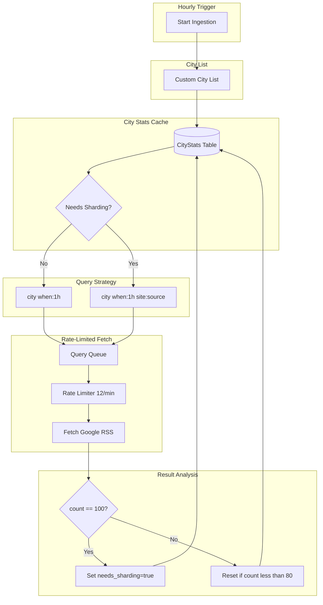

# Brazil-Wide News Ingestion with Adaptive Sharding

## Architecture Overview

All cities start with standard queries. When a city hits 100 results, the system automatically switches to source-based sharding for subsequent fetches.




## Key Design Decisions

### 1. All Cities Start Standard

```python
# Every city gets a simple query initially
def get_query_for_city(city: str, stats: CityStats) -> list[str]:
    if stats and stats.needs_sharding:
        # Sharding mode: one query per source
        return [f"{city} when:1h site:{src}" for src in BRAZILIAN_NEWS_SOURCES]
    else:
        # Standard mode: single query
        return [f"{city} when:1h"]
```


### 2. Automatic Sharding Detection

After each fetch, check if we hit the limit:

```python
def process_fetch_result(city: str, result_count: int):
    stats = get_or_create_city_stats(city)
    
    if result_count >= 100:
        # Hit limit - enable sharding for next run
        stats.needs_sharding = True
        stats.hit_limit_count += 1
        logger.info(f"{city}: Hit 100 limit, enabling source sharding")
    elif result_count < 80 and stats.needs_sharding:
        # Volume dropped significantly - could disable sharding
        # (optional: keep sharding once enabled to avoid flip-flopping)
        pass
    
    stats.last_result_count = result_count
    stats.last_fetch_at = datetime.utcnow()
    db.session.commit()
```


### 3. CityStats Model

```python
class CityStats(db.Model):
    id = db.Column(db.Integer, primary_key=True)
    city_name = db.Column(db.String(200), unique=True, nullable=False)
    needs_sharding = db.Column(db.Boolean, default=False)
    last_result_count = db.Column(db.Integer, default=0)
    hit_limit_count = db.Column(db.Integer, default=0)  # How many times hit 100
    last_fetch_at = db.Column(db.DateTime)
    created_at = db.Column(db.DateTime, default=datetime.utcnow)
```


### 4. Brazilian News Sources for Sharding

When sharding kicks in, query each major source:

```python
BRAZILIAN_NEWS_SOURCES = [
    "g1.globo.com",
    "uol.com.br",
    "folha.uol.com.br",
    "estadao.com.br",
    "oglobo.globo.com",
    "r7.com",
    "terra.com.br",
    "metropoles.com",
    "correiobraziliense.com.br",
    "gazetadopovo.com.br",
    "band.uol.com.br",
    "cnn.com.br",
    "jovempan.com.br",
    "sbt.com.br",
    "recordtv.r7.com",
    # Regional sources can be added
]
```


### 5. Rate Limiting

Token bucket at 12 requests/minute (720/hour):

```python
class RateLimiter:
    def __init__(self, requests_per_minute=12):
        self.interval = 60.0 / requests_per_minute  # 5 seconds between requests
        self.last_request = 0
    
    def wait(self):
        now = time.time()
        elapsed = now - self.last_request
        if elapsed < self.interval:
            time.sleep(self.interval - elapsed)
        self.last_request = time.time()
```


## Capacity Example

Starting with 100 cities, all standard:

- Hour 1: 100 queries (8 min) → 3 cities hit 100
- Hour 2: 97 standard + 3 sharded (3 x 15 sources = 45) = 142 queries (12 min)
- Hour 3: 95 standard + 5 sharded = 170 queries (14 min)
- Stabilizes around 200-300 queries/hour depending on news cycle

## Files to Create/Modify

| File | Action | Purpose ||------|--------|---------|| [`app/services/cities.py`](app/services/cities.py) | Create | City list and query generation || [`app/services/sources.py`](app/services/sources.py) | Create | Brazilian news source list || [`app/services/rate_limiter.py`](app/services/rate_limiter.py) | Create | Simple rate limiter || [`app/models.py`](app/models.py) | Modify | Add CityStats model || [`app/services/ingestion.py`](app/services/ingestion.py) | Modify | Integrate adaptive sharding || [`migrations/`](migrations/) | Create | Migration for CityStats table |

## Flow Summary

1. Load city list from config
2. For each city, check CityStats.needs_sharding
3. Generate queries (1 for standard, N for sharded)