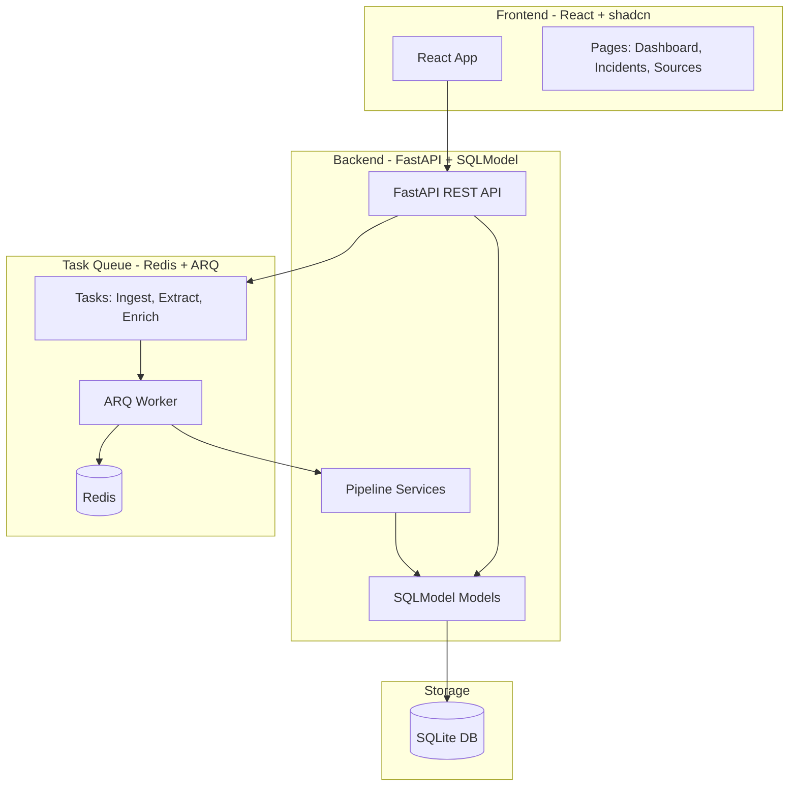
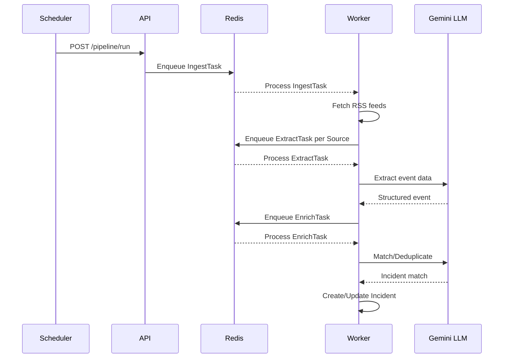

# v1 Architecture Rebuild

## Architecture Overview




## Pipeline Flow




## Directory Structure

```javascript
v1/
├── backend/
│   ├── app/
│   │   ├── __init__.py
│   │   ├── main.py              # FastAPI app factory
│   │   ├── config.py            # Settings (Pydantic BaseSettings)
│   │   ├── database.py          # SQLModel engine/session
│   │   ├── models/
│   │   │   ├── __init__.py
│   │   │   ├── source_google_news.py   # GoogleNews feed model
│   │   │   ├── raw_event.py         # RawEvent extracted from any source model
│   │   │   └── unique_event.py      # UniqueEvent model
│   │   ├── routers/
│   │   │   ├── __init__.py
│   │   │   ├── unique_events.py     # CRUD endpoints
│   │   │   ├── source_google_news.py
│   │   │   ├── raw_event.py
│   │   │   └── pipeline.py      # Pipeline control endpoints
│   │   ├── services/
│   │   │   ├── __init__.py
│   │   │   ├── ingestion.py     # RSS fetching logic
│   │   │   ├── extraction.py    # Content + LLM extraction
│   │   │   ├── enrichment.py    # Deduplication + linking
│   │   │   └── llm.py           # Gemini client wrapper
│   │   └── tasks/
│   │       ├── __init__.py
│   │       ├── worker.py        # ARQ worker config
│   │       └── pipeline.py      # Task definitions
│   ├── tests/
│   ├── pyproject.toml
│   └── alembic/                 # Migrations
├── frontend/
│   ├── src/
│   │   ├── components/
│   │   │   └── ui/              # shadcn components
│   │   ├── pages/
│   │   │   ├── Dashboard.tsx
│   │   │   ├── UniqueEvents.tsx
│   │   │   ├── RawEvents.tsx
│   │   │   ├── SourceGoogleNews.tsx
│   │   │   └── About.tsx
│   │   ├── lib/
│   │   │   └── api.ts           # API client
│   │   └── App.tsx
│   ├── package.json
│   └── vite.config.ts
├── docker-compose.yml           # Redis + services
└── README.md
```


## Key Implementation Details

### Backend Models (SQLModel)

Models will be defined using SQLModel which combines SQLAlchemy and Pydantic:

```python
# Example: app/models/incident.py
from sqlmodel import SQLModel, Field
from datetime import datetime
from decimal import Decimal

class IncidentBase(SQLModel):
    title: str = Field(max_length=256)
    date: datetime | None = None
    victims: str | None = None
    death_count: int | None = None
    # Location fields
    country: str | None = Field(default="Brasil")
    state: str | None = Field(default="Rio de Janeiro")
    city: str | None = Field(default="Rio de Janeiro")
    neighborhood: str | None = None
    street: str | None = None
    # Geocoding
    latitude: Decimal | None = None
    longitude: Decimal | None = None

class Incident(IncidentBase, table=True):
    id: int | None = Field(default=None, primary_key=True)
    confirmed: bool = False
    created_at: datetime = Field(default_factory=datetime.utcnow)
```


### ARQ Task Queue

Tasks will be async functions processed by ARQ workers:

```python
# Example: app/tasks/pipeline.py
from arq import cron
from app.services.ingestion import ingest_feeds
from app.services.extraction import extract_source
from app.services.enrichment import enrich_extraction

async def ingest_task(ctx):
    """Stage 1: Fetch RSS and create Sources."""
    sources = await ingest_feeds()
    for source in sources:
        await ctx["redis"].enqueue_job("extract_task", source.id)

async def extract_task(ctx, source_id: int):
    """Stage 2: Extract content and create ExtractedEvent."""
    extraction = await extract_source(source_id)
    if extraction:
        await ctx["redis"].enqueue_job("enrich_task", extraction.id)

async def enrich_task(ctx, extraction_id: int):
    """Stage 3: Deduplicate and link to Incident."""
    await enrich_extraction(extraction_id)

# Scheduled job (runs every 30 minutes)
class WorkerSettings:
    functions = [ingest_task, extract_task, enrich_task]
    cron_jobs = [
        cron(ingest_task, hour=None, minute={0, 30})
    ]
```


### Frontend Pages

| Page | Features ||------|----------|| Dashboard | Deaths by day chart, summary stats, recent incidents || UniqueEvent | DataTable with search, pagination, detail modal || Sources | Source list, status badges, extraction trigger || Download | CSV/JSON export options || About | Project information |

## Implementation Phases

### Phase 1: Backend Foundation

- Set up FastAPI project structure
- Define SQLModel models (Source, ExtractedEvent, Incident)
- Set up database with Alembic migrations
- Create basic CRUD routers

### Phase 2: Task Queue Integration

- Set up Redis + ARQ
- Port ingestion service to async
- Port extraction service to async (with Gemini)
- Port enrichment service to async
- Create pipeline control endpoints

### Phase 3: Frontend Development

- Set up React + Vite + shadcn
- Create API client with React Query
- Build Dashboard page with charts
- Build Incidents table with shadcn DataTable
- Build Sources management page

### Phase 4: Polish and Deploy

- Add authentication (optional)
- Docker Compose for all services
- Production deployment config

## Key Dependencies

**Backend:**

- `fastapi`, `uvicorn` - Web framework
- `sqlmodel` - ORM
- `arq` - Task queue
- `redis` - Queue backend
- `trafilatura` - Content extraction
- `google-cloud-aiplatform` - Gemini LLM
- `feedparser` - RSS parsing
- `instructor`  - Content extraction with LLM

**Frontend:**

- `react`, `react-router-dom`
- `@tanstack/react-query` - Data fetching