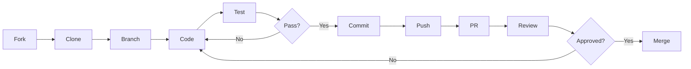

# 🤝 Guia de Contribuição

Obrigado por considerar contribuir com o **Arquivo da Violência**! Este documento contém diretrizes para ajudar você a contribuir de forma efetiva.

## 📋 Índice

- [Código de Conduta](#código-de-conduta)
- [Como Posso Contribuir?](#como-posso-contribuir)
- [Processo de Desenvolvimento](#processo-de-desenvolvimento)
- [Guia de Estilo](#guia-de-estilo)
- [Estrutura do Projeto](#estrutura-do-projeto)

---

## 📜 Código de Conduta

### Nosso Compromisso

Este projeto se compromete a fornecer um ambiente acolhedor e livre de assédio para todos, independentemente de:
- Idade, tamanho corporal, deficiência
- Etnia, identidade e expressão de gênero
- Nível de experiência, nacionalidade
- Aparência pessoal, raça, religião
- Identidade e orientação sexual

### Comportamentos Esperados

✅ **Faça:**
- Use linguagem acolhedora e inclusiva
- Respeite pontos de vista e experiências diferentes
- Aceite críticas construtivas com elegância
- Foque no que é melhor para a comunidade
- Mostre empatia com outros membros

❌ **Não faça:**
- Use linguagem ou imagens sexualizadas
- Faça ataques pessoais ou políticos
- Assédio público ou privado
- Publique informações privadas de outros
- Condutas não-profissionais ou inadequadas

---

## 🚀 Como Posso Contribuir?

### 🐛 Reportando Bugs

Antes de criar um report de bug, verifique se já não existe uma issue sobre o problema.

**Template de Bug Report:**

```markdown
**Descrição do Bug**
Uma descrição clara do que é o bug.

**Passos para Reproduzir**
1. Vá para '...'
2. Clique em '...'
3. Role até '...'
4. Veja o erro

**Comportamento Esperado**
O que você esperava que acontecesse.

**Screenshots**
Se aplicável, adicione screenshots.

**Ambiente:**
 - OS: [ex: Ubuntu 22.04]
 - Docker version: [ex: 24.0.0]
 - Browser [ex: Chrome 120]

**Contexto Adicional**
Qualquer outra informação relevante.
```

### 💡 Sugerindo Melhorias

**Template de Feature Request:**

```markdown
**Problema que Resolve**
Descreva o problema que esta feature resolveria.

**Solução Proposta**
Descreva como você imagina a solução.

**Alternativas Consideradas**
Outras abordagens que você considerou.

**Contexto Adicional**
Screenshots, mockups, exemplos, etc.
```

### 🔧 Pull Requests

1. **Fork e Clone**
   ```bash
   git clone https://github.com/seu-usuario/arquivo-da-violencia.git
   cd arquivo-da-violencia
   ```

2. **Crie uma Branch**
   ```bash
   git checkout -b tipo/nome-da-mudanca
   ```
   
   Tipos:
   - `feature/` - Nova funcionalidade
   - `fix/` - Correção de bug
   - `docs/` - Mudanças na documentação
   - `style/` - Formatação, ponto e vírgula, etc
   - `refactor/` - Refatoração de código
   - `test/` - Adição ou correção de testes
   - `chore/` - Atualizações de build, CI, etc

3. **Faça suas Mudanças**
   - Escreva código limpo e legível
   - Adicione testes quando apropriado
   - Atualize documentação
   - Siga o guia de estilo

4. **Commit**
   ```bash
   git add .
   git commit -m "tipo: descrição concisa da mudança"
   ```
   
   Exemplos:
   - `feat: adiciona filtro por cidade na API`
   - `fix: corrige erro de timezone nos gráficos`
   - `docs: atualiza instruções de instalação`

5. **Push e PR**
   ```bash
   git push origin tipo/nome-da-mudanca
   ```
   
   Então abra um Pull Request no GitHub.

**Template de Pull Request:**

```markdown
**Descrição**
Descreva o que este PR faz.

**Tipo de Mudança**
- [ ] Bug fix
- [ ] Nova feature
- [ ] Breaking change
- [ ] Documentação

**Checklist**
- [ ] Meu código segue o guia de estilo
- [ ] Revisei meu próprio código
- [ ] Comentei código complexo
- [ ] Atualizei a documentação
- [ ] Minhas mudanças não geram warnings
- [ ] Adicionei testes
- [ ] Todos os testes passam
- [ ] Atualizei o CHANGELOG (se aplicável)

**Testes**
Descreva os testes que você executou.

**Screenshots** (se aplicável)
```

---

## 🛠️ Processo de Desenvolvimento

### Setup do Ambiente

1. **Instale as dependências:**
   ```bash
   # Backend
   cd backend
   uv sync
   source .venv/bin/activate
   
   # Frontend
   cd frontend
   npm install
   ```

2. **Configure pre-commit hooks:**
   ```bash
   cd backend
   pre-commit install
   ```

3. **Rode os testes:**
   ```bash
   # Backend
   pytest
   
   # Frontend
   npm test
   ```

### Workflow de Desenvolvimento



### Rodando Testes

```bash
# Backend - todos os testes
pytest

# Backend - com coverage
pytest --cov=app --cov-report=html

# Backend - apenas um arquivo
pytest tests/test_pipeline.py

# Frontend
npm test

# Frontend - watch mode
npm test -- --watch

# End-to-end
docker compose -f docker-compose.test.yml up --abort-on-container-exit
```

### Criando Migrações de DB

```bash
# Criar uma nova migração
docker compose exec api alembic revision --autogenerate -m "descrição"

# Aplicar migrações
docker compose exec api alembic upgrade head

# Reverter migração
docker compose exec api alembic downgrade -1
```

---

## 🎨 Guia de Estilo

### Python (Backend)

Usamos **Ruff** para linting e formatação.

```bash
# Formatar código
ruff format .

# Lint
ruff check .

# Auto-fix
ruff check --fix .
```

**Convenções:**
- PEP 8 style guide
- Docstrings em todas as funções públicas
- Type hints em todas as assinaturas
- Máximo 100 caracteres por linha

```python
# Bom
def extract_event(article: str, model: str = "gemini-2.5-flash") -> RawEvent:
    """
    Extrai um evento estruturado de um artigo.
    
    Args:
        article: Texto completo do artigo
        model: Nome do modelo LLM a usar
        
    Returns:
        Evento extraído com informações estruturadas
        
    Raises:
        ExtractionError: Se a extração falhar
    """
    pass

# Ruim
def extract(a, m="gemini-2.5-flash"):
    pass
```

### TypeScript (Frontend)

Usamos **ESLint** e **Prettier**.

```bash
# Lint
npm run lint

# Format
npm run format
```

**Convenções:**
- Prefer `const` over `let`
- Functional components com hooks
- Type tudo explicitamente
- Export named components

```typescript
// Bom
interface EventCardProps {
  event: UniqueEvent;
  onSelect: (id: number) => void;
}

export function EventCard({ event, onSelect }: EventCardProps) {
  const handleClick = () => onSelect(event.id);
  
  return (
    <Card onClick={handleClick}>
      <CardHeader>{event.title}</CardHeader>
    </Card>
  );
}

// Ruim
export default ({ event, onSelect }) => (
  <div onClick={() => onSelect(event.id)}>
    {event.title}
  </div>
);
```

### Git Commits

Use **Conventional Commits**:

```
tipo(escopo): descrição curta

Descrição mais longa, se necessário.

Refs: #123
```

**Tipos:**
- `feat`: Nova feature
- `fix`: Bug fix
- `docs`: Apenas documentação
- `style`: Formatação
- `refactor`: Refatoração
- `perf`: Melhoria de performance
- `test`: Adição de testes
- `chore`: Manutenção

**Exemplos:**
```bash
feat(api): adiciona endpoint de busca por cidade

fix(frontend): corrige erro de timezone nos gráficos

docs(readme): atualiza instruções de instalação

test(pipeline): adiciona testes para deduplicação
```

---

## 📁 Estrutura do Projeto

```
arquivo-da-violencia/
├── backend/                 # API FastAPI
│   ├── app/
│   │   ├── main.py         # Entry point
│   │   ├── auth.py         # Autenticação JWT
│   │   ├── models/         # SQLModel models
│   │   ├── routers/        # API endpoints
│   │   ├── services/       # Lógica de negócio
│   │   ├── tasks/          # ARQ workers
│   │   └── utils/          # Utilities
│   ├── alembic/            # Migrations
│   ├── tests/              # Testes
│   ├── pyproject.toml      # Dependências
│   └── Dockerfile
│
├── frontend/               # React SPA
│   ├── src/
│   │   ├── components/     # Componentes reutilizáveis
│   │   ├── contexts/       # React contexts
│   │   ├── lib/           # Utils e API client
│   │   ├── pages/         # Páginas
│   │   │   ├── admin/     # Painel admin
│   │   │   └── public/    # Site público
│   │   ├── App.tsx        # Root component
│   │   └── main.tsx       # Entry point
│   ├── public/            # Assets estáticos
│   ├── package.json       # Dependências
│   └── Dockerfile
│
├── docs/                  # Documentação adicional
├── .github/              # GitHub workflows
├── docker-compose.yml    # Orquestração
├── README.md
├── CONTRIBUTING.md
└── LICENSE
```

---

## 🔍 Review Process

### O que os Reviewers Checam

1. **Funcionalidade**
   - Código faz o que propõe?
   - Casos edge são tratados?
   - Há breaking changes?

2. **Qualidade**
   - Código é legível?
   - Há duplicação?
   - Segue convenções?

3. **Testes**
   - Há testes adequados?
   - Todos passam?
   - Coverage é adequado?

4. **Documentação**
   - Código complexo está comentado?
   - README está atualizado?
   - API docs estão atualizadas?

5. **Performance**
   - Há problemas de performance?
   - Queries de DB são otimizadas?
   - Bundle size aumentou muito?

### Tempo de Review

- PRs pequenos (< 200 linhas): 1-2 dias
- PRs médios (200-500 linhas): 2-4 dias
- PRs grandes (> 500 linhas): 4-7 dias

💡 **Dica:** Prefira PRs menores e focados!

---

## 🎓 Recursos para Iniciantes

### Primeira Contribuição?

Procure issues com as labels:
- `good first issue` - Boas para começar
- `help wanted` - Precisamos de ajuda
- `documentation` - Melhorias na docs

### Aprendendo as Tecnologias

**Backend:**
- [FastAPI Tutorial](https://fastapi.tiangolo.com/tutorial/)
- [SQLModel Docs](https://sqlmodel.tiangolo.com/)
- [ARQ Guide](https://arq-docs.helpmanual.io/)

**Frontend:**
- [React Docs](https://react.dev/)
- [TanStack Query](https://tanstack.com/query/latest)
- [shadcn/ui](https://ui.shadcn.com/)

**DevOps:**
- [Docker Tutorial](https://docs.docker.com/get-started/)
- [Docker Compose](https://docs.docker.com/compose/)

---

## 💬 Dúvidas?

- 📧 Email: joao.carabetta@gmail.com
- 💬 Abra uma [Discussion](https://github.com/JoaoCarabetta/arquivo-da-violencia/discussions)
- 🐛 Para bugs, abra uma [Issue](https://github.com/JoaoCarabetta/arquivo-da-violencia/issues)

---

## 🙏 Agradecimentos

Obrigado por dedicar seu tempo para contribuir! Cada contribuição, não importa o tamanho, faz diferença. 

**Juntos podemos construir uma ferramenta melhor para entender e combater a violência no Brasil!** 🇧🇷

---

<div align="center">

[](https://github.com/JoaoCarabetta/arquivo-da-violencia/graphs/contributors)

*Este projeto segue a especificação [Contributor Covenant](https://www.contributor-covenant.org/).*

</div>

